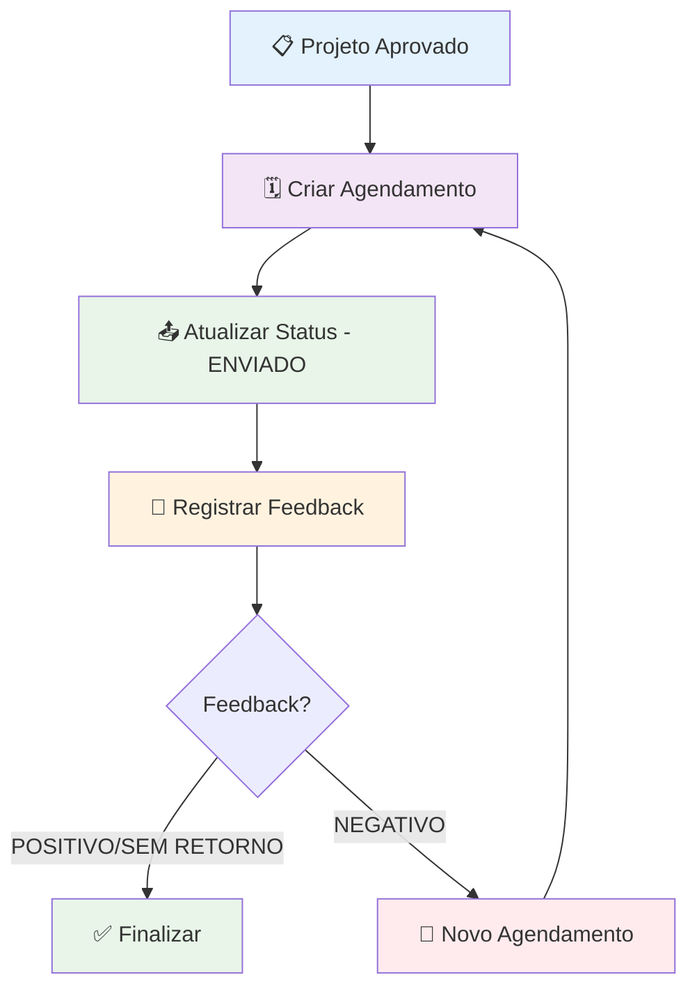

# 🗓️ Sistema de Agendamentos - Dominic Esquadrias

Sistema completo para gerenciamento de agendamentos de esquadrias, integrado com Google Agenda e planilha de projetos, desenvolvido em Google Apps Script para automatizar o fluxo de trabalho desde a criação até o feedback final dos projetos.

## 🔧 Desenvolvimento e Edição do Código

### ⚠️ **REGRAS CRÍTICAS PARA MANUTENÇÃO**

#### 1. Sincronização com CLASP

- **SEMPRE** utilize o [Google CLASP](https://github.com/google/clasp) para edição do código Apps Script
- **NUNCA** edite diretamente no editor web do Google Apps Script (pode causar perda de código)
- Mantenha a sincronização entre o repositório local e o projeto Apps Script

#### 2. Workflow de Desenvolvimento

```bash
# 1. Clonar o projeto (primeira vez)
git clone [URL_REPOSITORIO]
cd agendamentos

# 2. Instalar CLASP globalmente
npm install -g @google/clasp

# 3. Fazer login na conta Google
clasp login

# 4. Conectar ao projeto Apps Script existente
clasp clone [SCRIPT_ID]

# 5. Workflow de desenvolvimento:
# - Editar arquivos localmente em /src
# - Testar mudanças
clasp push  # Envia para Apps Script

# 6. Commit no repositório
git add .
git commit -m "feat: descrição da alteração"
git push origin main
```

#### 3. Estrutura de Projeto CLASP

```
.clasp.json          # Configuração do CLASP (ID do script)
src/                 # Código fonte sincronizado
├── *.js            # Arquivos JavaScript
├── *.html          # Interfaces HTML
└── appsscript.json # Configuração do Apps Script
```

## 🏢 Regras de Negócio e Fluxo do Sistema

### 📋 **Fluxo Principal Completo**



### 📊 **Etapas e Responsabilidades**

| Etapa | Responsável | Ação | Status Resultante |
|-------|------------|------|------------------|
| 1 | Gestor | Criar agendamento via planilha de projetos | CRIADO |
| 2 | Equipe | Executar serviço e registrar envio | ENVIADO |
| 3 | Cliente | Fornecer feedback sobre o serviço | FEEDBACK_REGISTRADO |
| 4 | Sistema | Finalizar automaticamente ou solicitar retorno | FINALIZADO/RETORNO |

### 🔄 **Regras de Status e Transições**

#### **Status de Envio (Coluna P16)**
- `""` (vazio): Agendamento criado, aguardando execução
- `"ENVIADO"`: Serviço executado e cliente notificado
- **Regra**: Apenas agendamentos "ENVIADO" podem receber feedback

#### **Tipos de Feedback (Coluna T20)**
- `"POSITIVO"`: Cliente satisfeito → Finaliza automaticamente
- `"NEGATIVO"`: Cliente insatisfeito → Exige novo agendamento
- `"SEM RETORNO"`: Cliente não respondeu → Finaliza automaticamente

#### **Regras Automáticas de Finalização (Coluna V22)**

| Condição | Ação | Data Preenchida |
|----------|------|----------------|
| Feedback = POSITIVO | Finaliza imediatamente | Data atual |
| Feedback = SEM RETORNO | Finaliza imediatamente | Data atual |
| Feedback = NEGATIVO + ID retorno válido | Finaliza | Data atual |
| Feedback = NEGATIVO + sem ID retorno | **NÃO** finaliza | Vazio |

### 📅 **Calendários e Equipes**

O sistema integra com múltiplos calendários do Google baseado na equipe:

| Equipe | Calendário | ID do Calendário | Cor |
|--------|------------|-----------------|-----|
| MONTAGEM A | Agenda Instalações | `30coraha1d4fevp1rj6b3elh9c@group.calendar.google.com` | Azul (11) |
| MONTAGEM B | Agenda Instalações | `30coraha1d4fevp1rj6b3elh9c@group.calendar.google.com` | Verde (9) |
| ENTREGA | Agenda Instalações | `30coraha1d4fevp1rj6b3elh9c@group.calendar.google.com` | Amarelo (5) |
| VIDRAÇARIA | Agenda Vidraçaria | `q8i7h3hpilhpt7g5qa6es90bk0@group.calendar.google.com` | Laranja (6) |
| SERRALHERIA | Agenda Serralheria | `st38llhrnh9lkp8nlkg2ui7c48@group.calendar.google.com` | Vermelho (10) |

## 🏗️ Arquitetura e Organização do Código

### 📁 **Estrutura de Arquivos Detalhada**

```
src/
├── 🔧 Configuração e Constantes
│   ├── appsscript.json              # Configuração do Apps Script (APIs, macros)
│   └── GLOBAL_CONST.js              # Constantes globais e mapeamento de colunas
│
├── 💼 Lógica de Negócio (Backend)
│   ├── utils.js                     # Funções utilitárias e menu principal
│   └── agendamentos_managment.js    # Core do sistema - CRUD de agendamentos
│
└── 🎨 Interfaces do Usuário (Frontend)
    ├── agendamentos.html            # Formulário de criação de agendamentos
    ├── agendamentos_status.html     # Formulário de atualização de status
    └── agendamentos_feedback.html   # Formulário de registro de feedback
```

### 🔄 **Padrão Arquitetural MVC Adaptado**

- **📱 View (HTML)**: Interfaces responsivas com Tailwind CSS + jQuery
- **🎮 Controller (utils.js)**: Funções de menu e coordenação
- **💼 Model (agendamentos_managment.js)**: Lógica de negócio e acesso a dados
- **💾 Data (Google Sheets)**: Planilha como banco de dados

### 🎯 **Sistema de Menu Integrado**

```javascript
🗓️ Agendamentos
├── 🗓️ Criar Agendamentos          → onOpenAgendamentosCreate()
├── 📝 Adicionar Status de Agendamento → onOpenAgendamentosStatus()
├── 💬 Registrar Feedback de Agendamento → onOpenAgendamentosFeedback()
└── 🗑️ Excluir Agendamentos       → onOpenAgendamentosDelete()
```

## 📚 Documentação Detalhada dos Arquivos

### ⚙️ **Arquivos de Configuração**

#### `appsscript.json` (42 linhas)
**Responsabilidade**: Configuração central do projeto Apps Script

```json
{
  "timeZone": "America/Sao_Paulo",
  "dependencies": {
    "enabledAdvancedServices": [
      {"userSymbol": "Calendar", "version": "v3", "serviceId": "calendar"}
    ]
  },
  "runtimeVersion": "V8",
  "sheets": {
    "macros": [...] // Todas as funções de menu registradas
  }
}
```

**APIs Habilitadas**:
- ✅ Google Calendar API (v3) - Criação e gestão de eventos
- ✅ Google Sheets API (nativo) - Acesso à planilha
- ✅ Google Maps API (para validação de endereços)

#### `GLOBAL_CONST.js` (107 linhas)
**Responsabilidade**: Centralização de constantes e mapeamento da planilha

**Principais Exportações**:
```javascript
const ss = SpreadsheetApp.getActive();           // Planilha ativa
const shAGENDAMENTOS = ss.getSheetByName("AGENDAMENTOS"); // Aba principal
const START_ROW = 4;                             // Primeira linha de dados
const TZ = Session.getScriptTimeZone();          // Timezone do sistema

const COLUMNS = {
  UUID: { letter: "A", number: 1 },              // Identificador único
  PROJECT_ID: { letter: "B", number: 2 },        // ID do projeto
  ID: { letter: "C", number: 3 },                // ID do agendamento (AGT-xxxxxxxx)
  // ... mapeamento completo até coluna Y25
};
```

**Por que é importante**: Qualquer mudança na estrutura da planilha deve ser refletida aqui primeiro.

### 🔧 **Arquivos de Lógica de Negócio**

#### `utils.js` (366 linhas)
**Responsabilidade**: Funções utilitárias e coordenação do sistema

**Principais Funções**:

##### `onOpen()` - Menu Principal
```javascript
function onOpen() {
  SpreadsheetApp.getUi()
    .createMenu("🗓️ Agendamentos")
    .addItem("🗓️ Criar Agendamentos", "onOpenAgendamentosCreate")
    // ... outros itens de menu
    .addToUi();
}
```

##### Funções de Interface
- **`onOpenAgendamentosCreate()`**: Abre formulário de criação (800x600px)
- **`onOpenAgendamentosStatus()`**: Abre formulário de status (1200x800px)
- **`onOpenAgendamentosFeedback()`**: Abre formulário de feedback (1200x800px)
- **`onOpenAgendamentosDelete()`**: Chama `promptDeleteAppointment()`

##### Funções Utilitárias
- **`getApprovedProjectsData(projectId?)`**: Busca projetos aprovados da planilha externa
- **`getIdentifier(uuid, prefix="AGT")`**: Gera ID do agendamento (AGT-xxxxxxxx)
- **`hasExistingPurchaseRecord(projectId)`**: Verifica se projeto já tem agendamento
- **`getAppointmentPresets()`**: Carrega dados para formulários
- **`addBusinessDays(startDate, businessDays)`**: Calcula dias úteis
- **`getProjectData(projectId)`**: Busca dados específicos de um projeto
- **`applyEventColor(event, title)`**: Aplica cores aos eventos do calendário

#### `agendamentos_managment.js` (688 linhas)
**Responsabilidade**: Core do sistema - toda lógica CRUD de agendamentos

**Principais Funções por Responsabilidade**:

##### 🔍 Validação e Busca
```javascript
function validateAddress(address)                    // Valida endereço via Google Maps
function findAppointmentRow(appointmentId)          // Busca agendamento (colunas A-S)
function findAppointmentRowExtended(appointmentId)  // Busca agendamento (colunas A-Y)
```

##### 📝 CRUD de Agendamentos
```javascript
function saveAppointmentRecord(formData)            // Cria novo agendamento
function updateAppointmentStatus(statusData)        // Atualiza status (P16-S19)
function deleteAppointment(appointmentId)           // Remove agendamento
function promptDeleteAppointment()                  // Interface de exclusão
```

##### 💬 Gestão de Feedback
```javascript
function saveProjectFeedback(feedbackData)         // Salva feedback (T20-Y25)
function getAppointmentsForFeedback()              // Lista agendamentos ENVIADOS
```

##### 🗓️ Integração com Calendário
```javascript
function getCalendarByTeam(teamName)               // Mapeia equipe → calendário
function createSingleCalendarEvent(eventData)      // Cria evento no Google Agenda
```

##### 📊 Dados para Interfaces
```javascript
function getAppointmentsForStatusUpdate()          // Lista para atualização de status
```

**Fluxo de Criação de Agendamento**:
1. Validar dados obrigatórios e datas
2. Gerar UUID e ID do agendamento
3. Inserir nova linha na planilha (sempre no topo)
4. Mapear equipe para calendário correto
5. Criar evento no Google Agenda
6. Preencher dados na planilha (colunas A-O + observações)
7. Retornar resultado com ID e nome do calendário

### 🎨 **Arquivos de Interface**

#### `agendamentos.html` (562 linhas)
**Responsabilidade**: Formulário principal de criação de agendamentos

**Tecnologias Utilizadas**:
- **Tailwind CSS**: Framework CSS utilitário para estilização responsiva
- **jQuery**: Manipulação DOM e eventos
- **jQuery Mask**: Formatação automática de campos (telefone)
- **Google Maps API**: Validação de endereços em tempo real

**Estrutura Visual**:
```
┌─────────────────────────────────────┐
│ 🗓️ REGISTRO DE AGENDAMENTOS         │
├─────────────────────────────────────┤
│ 📋 Seleção de Projeto               │
│ ├─ Dropdown com projetos aprovados  │
│ └─ Auto-preenchimento de dados      │
├─────────────────────────────────────┤
│ 🔧 Detalhes do Agendamento          │
│ ├─ Etapa do projeto                 │
│ ├─ Descrição do serviço             │
│ ├─ Equipe responsável               │
│ └─ Data/hora início e fim           │
├─────────────────────────────────────┤
│ 📍 Localização e Contato            │
│ ├─ Endereço (validação automática)  │
│ └─ Telefone (máscara automática)    │
├─────────────────────────────────────┤
│ ✅ Status de Validação              │
│ └─ [Limpar] [Criar Agendamento]     │
└─────────────────────────────────────┘
```

**Principais Funcionalidades JavaScript**:
- **Validação em Tempo Real**: Formulário habilita/desabilita botão conforme preenchimento
- **Validação de Endereços**: Integração com Google Maps para verificar endereços válidos
- **Auto-preenchimento**: Seleção de projeto carrega automaticamente dados do cliente
- **Máscaras**: Telefone formatado automaticamente como (XX) XXXXX-XXXX
- **Feedback Visual**: Loading states, validação de campos, mensagens de erro/sucesso

#### `agendamentos_status.html` (555 linhas)
**Responsabilidade**: Interface para atualização de status de agendamentos

**Funcionalidades Específicas**:
- **Filtros Avançados**: Busca por ID, cliente, projeto, status e equipe
- **Tabela Responsiva**: Lista todos os agendamentos com dados essenciais
- **Modal de Atualização**: Interface dedicada para alterar status
- **Cálculos Automáticos**: Prazos limite calculados automaticamente (3 dias úteis)
- **Indicadores Visuais**: Cores para prazos vencidos e próximos do vencimento

**Regras Implementadas**:
- Data limite = data de aprovação + 3 dias úteis
- Data de envio preenchida automaticamente quando status = "ENVIADO"
- Observações do projetista copiadas automaticamente da planilha de projetos

#### `agendamentos_feedback.html` (599 linhas)
**Responsabilidade**: Registro de feedback dos clientes

**Recursos Especiais**:
- **Filtro de Segurança**: Só mostra agendamentos com status "ENVIADO"
- **Validação Condicional**: ID de retorno obrigatório apenas para feedback NEGATIVO
- **Regex de Validação**: ID de retorno deve seguir padrão AGT-xxxxxxxx
- **Preenchimento Automático**: Datas de feedback e retorno preenchidas automaticamente
- **Regras de Finalização**: Data de finalização baseada no tipo de feedback

## 💾 Estrutura de Dados (Google Sheets)

### 📊 **Planilha AGENDAMENTOS - Mapeamento Completo**

| Coluna | Campo | Tipo | Preenchimento | Descrição |
|--------|-------|------|---------------|-----------|
| **A** | UUID | String | Automático | Identificador único universal |
| **B** | PROJECT_ID | String | Manual | ID do projeto da planilha externa |
| **C** | ID | String | Automático | ID do agendamento (AGT-xxxxxxxx) |
| **D** | PROJECT_APPROVAL_DATE | Date | Automático | Data de criação do agendamento |
| **E** | PROJECT_NUMBER | String | Automático | Número do projeto (da planilha externa) |
| **F** | CLIENT_NAME | String | Automático | Nome do cliente |
| **G** | PROJECT_NAME | String | Automático | Nome da obra/projeto |
| **H** | PHONE | String | Manual | Telefone de contato |
| **I** | ADDRESS | String | Manual | Endereço do agendamento |
| **J** | PROJECT_STEP | String | Manual | Etapa do projeto (1, 2, 3, etc.) |
| **K** | APPOINTMENT_DESCRIPTION | String | Manual | Descrição detalhada do serviço |
| **L** | TEAM_NAME | String | Manual | Equipe responsável |
| **M** | APPOINTMENT_START_TIME | DateTime | Manual | Data/hora de início |
| **N** | APPOINTMENT_END_TIME | DateTime | Manual | Data/hora de término |
| **O** | APPOINTMENT_CALENDAR_ID | String | Automático | ID do evento no Google Agenda |
| **P** | APPOINTMENT_SENT_STATUS | String | Manual | Status do envio ("ENVIADO" ou vazio) |
| **Q** | APPOINTMENT_INSERTION_DEADLINE | DateTime | Automático | Prazo limite (aprovação + 3 dias úteis) |
| **R** | APPOINTMENT_SENT_DATE | DateTime | Automático | Data de envio (se status = ENVIADO) |
| **S** | PROJECT_OBS | String | Automático | Observações do projetista |
| **T** | PROJECT_FEEDBACK | String | Manual | Tipo de feedback (POSITIVO/NEGATIVO/SEM RETORNO) |
| **U** | PROJECT_RETURN_FEEDBACK | String | Condicional | ID do agendamento de retorno (só NEGATIVO) |
| **V** | PROJECT_DEADLINE | DateTime | Automático | Data de finalização do projeto |
| **W** | OBS | String | Manual | Observações sobre o feedback |
| **X** | PROJECT_FEEDBACK_DATE | DateTime | Automático | Data de registro do feedback |
| **Y** | PROJECT_FEEDBACK_RETURN_DATE | DateTime | Automático | Data de registro do retorno |

### 🔗 **Integração com Planilha Externa (PROJETOS)**

O sistema busca dados da planilha:
- **ID**: `1RzCF7X6MDi7EELV8it38hVdeALPROrHchlzjfpQYtdM`
- **Aba**: `PROJETOS`
- **Filtro**: Status = "APROVADO" (coluna J)
- **Dados**: Projetos que ainda não possuem agendamento

## 🔧 Funções Críticas para Manutenção

### 🛠️ **Funções que Requerem Atenção Especial**

#### 1. `saveAppointmentRecord()` - Criação de Agendamentos
**Localização**: `agendamentos_managment.js:159-245`
**Criticidade**: 🔴 ALTA

```javascript
// Sequência crítica que deve ser mantida:
1. Validação de dados obrigatórios
2. Inserção de nova linha na planilha (ANTES de criar evento)
3. Mapeamento de equipe para calendário
4. Criação do evento no Google Agenda
5. Preenchimento dos dados na planilha
```

**⚠️ Cuidados**:
- Se falhar na criação do evento, a linha já foi inserida na planilha
- Ordem das colunas no `rowData` deve corresponder exatamente ao `COLUMNS`
- Sempre inserir no `START_ROW` (linha 4) para manter ordem cronológica

#### 2. `getCalendarByTeam()` - Mapeamento de Calendários
**Localização**: `agendamentos_managment.js:251-281`
**Criticidade**: 🔴 ALTA

```javascript
// IDs dos calendários - NUNCA ALTERAR sem verificar no Google Calendar
const calendars = {
  "MONTAGEM A": { id: "30coraha1d4fevp1rj6b3elh9c@group.calendar.google.com" },
  "MONTAGEM B": { id: "30coraha1d4fevp1rj6b3elh9c@group.calendar.google.com" },
  // ...
};
```

**⚠️ Cuidados**:
- IDs de calendário são únicos e imutáveis
- Se calendario for excluído/recriado, ID muda completamente
- Usar `toUpperCase().includes()` para correspondência flexível

#### 3. `saveProjectFeedback()` - Regras de Feedback
**Localização**: `agendamentos_managment.js:435-537`
**Criticidade**: 🟡 MÉDIA

```javascript
// Regras de finalização que devem ser mantidas:
const shouldFillDeadline = 
  feedbackType === "POSITIVO" || 
  feedbackType === "SEM RETORNO" ||
  (feedbackType === "NEGATIVO" && returnAppointmentId);
```

**⚠️ Cuidados**:
- Lógica de finalização é complexa e baseada em regras de negócio
- Validação de regex para ID de retorno: `/^AGT-[a-fA-F0-9]{8}$/`
- Apenas agendamentos "ENVIADO" podem receber feedback

### 🔧 **Pontos de Integração Externa**

#### 1. Planilha PROJETOS Externa
**Função**: `getApprovedProjectsData()`
**ID**: `1RzCF7X6MDi7EELV8it38hVdeALPROrHchlzjfpQYtdM`

Se esta planilha mudar de estrutura, atualizar:
- Índices das colunas na função
- Filtros de status
- Mapeamento de dados no retorno

#### 2. Google Maps API
**Função**: `validateAddress()`
**Dependência**: Maps API habilitada no projeto

Se API for desabilitada ou atingir limite:
- Função retorna `false`
- Validação de endereço é opcional
- Sistema continua funcionando

#### 3. Google Calendar API
**Funções**: `createSingleCalendarEvent()`, `deleteEvent()`
**Dependência**: Calendar API v3

Se API falhar:
- Agendamento é criado na planilha mas sem evento
- Exclusão remove da planilha mas evento permanece
- Verificar permissões de acesso aos calendários

## 🚀 Guia de Manutenção Prática

### 📝 **Tarefas Comuns de Manutenção**

#### 1. Adicionar Nova Equipe
```javascript
// 1. Atualizar calendários em getCalendarByTeam()
"NOVA_EQUIPE": {
  id: "[ID_DO_CALENDARIO]",
  name: "Nome do Calendário"
}

// 2. Adicionar cor em applyEventColor()
else if (title.includes("(NOVA_EQUIPE)")) event.setColor("12");

// 3. Atualizar aba PRESETS na planilha
```

#### 2. Modificar Estrutura da Planilha
```javascript
// 1. Atualizar GLOBAL_CONST.js
NOVA_COLUNA: {
  letter: "Z",
  number: 26,
}

// 2. Ajustar funções que leem/escrevem dados
// 3. Atualizar ranges em getRange() calls
// 4. Modificar mapeamento em findAppointmentRow()
```

#### 3. Alterar Regras de Feedback
```javascript
// Localizar em saveProjectFeedback()
// Modificar lógica em shouldFillDeadline
// Atualizar validações conforme nova regra
// Documentar mudança neste README
```

### 🔍 **Debug e Troubleshooting**

#### Logs e Monitoramento
```javascript
// Verificar execuções em Apps Script > Executions
// Logs aparecem com console.log() e console.error()
// Erros de API aparecem com detalhes específicos
```

#### Problemas Comuns
1. **Calendário não encontrado**: Verificar IDs em `getCalendarByTeam()`
2. **Planilha externa indisponível**: Timeout em `getApprovedProjectsData()`
3. **Permissões insuficientes**: Erro ao acessar calendários ou planilhas
4. **Limite de API**: Muitas requisições ao Maps ou Calendar

### 📊 **Monitoramento de Performance**

#### Métricas a Acompanhar
- **Tempo de criação de agendamento**: < 5 segundos
- **Taxa de sucesso de validação de endereços**: > 90%
- **Falhas na criação de eventos**: < 1%
- **Consistency entre planilha e calendários**: 100%

## 🤝 Contribuição e Suporte

### 📋 **Checklist para Pull Requests**

- [ ] Código testado no ambiente Apps Script
- [ ] Documentação atualizada neste README
- [ ] Funções documentadas com JSDoc
- [ ] Tratamento de erros implementado
- [ ] Não quebra funcionalidades existentes
- [ ] CLASP sincronizado (`clasp push` executado)

### 🆘 **Onde Buscar Ajuda**

1. **Google Apps Script Docs**: [developers.google.com/apps-script](https://developers.google.com/apps-script)
2. **Calendar API Reference**: [developers.google.com/calendar](https://developers.google.com/calendar)
3. **Sheets API Reference**: [developers.google.com/sheets](https://developers.google.com/sheets)
4. **CLASP Documentation**: [github.com/google/clasp](https://github.com/google/clasp)

### 🐛 **Reportar Problemas**

Ao encontrar bugs, inclua:
- URL da planilha
- ID do agendamento problemático
- Captura de tela do erro
- Passos para reproduzir
- Logs do Apps Script (Executions)

---

**🔧 Desenvolvido por [Lucas Vieira](https://github.com/lkasvr) para Dominic Esquadrias**  
**📅 Versão**: 1.0.0 | **🛠️ Tecnologia**: Google Apps Script + Google Sheets + Google Calendar  
**📝 Última atualização**: 2025-01-01
